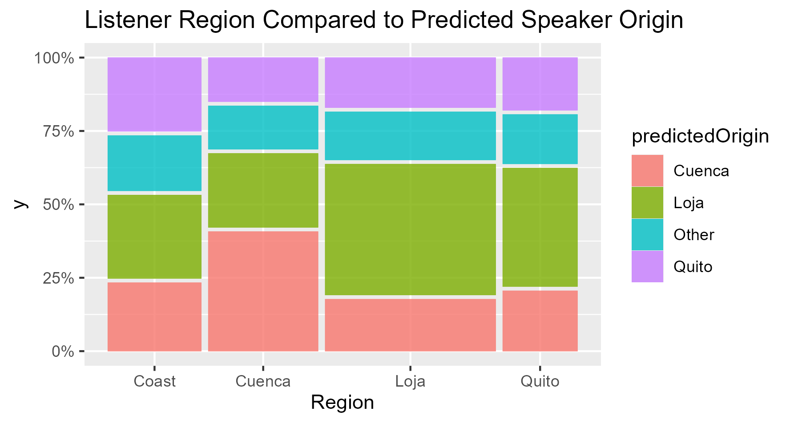
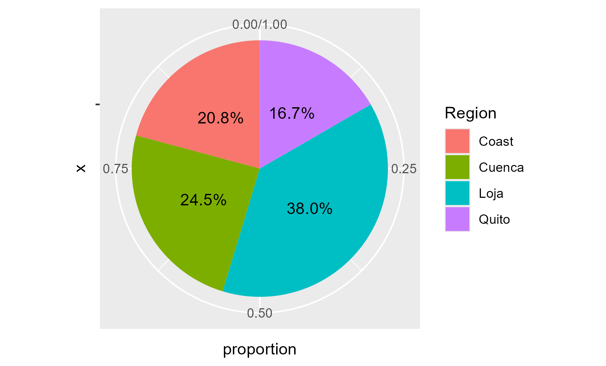
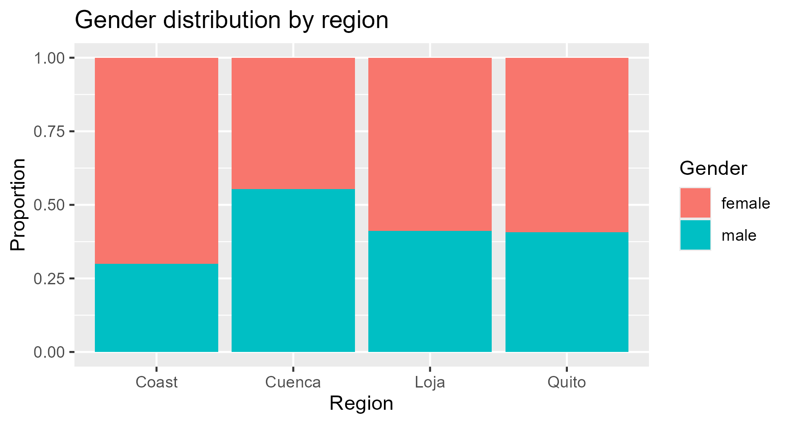
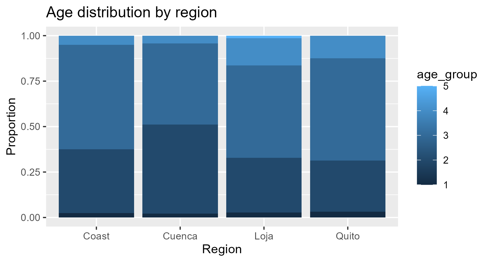

# 🎙️ Trilled vs. Assibilated /r/ Research

> A data-driven analysis of linguistic perception in Ecuadorian Spanish.

---

## 🌟 Highlights

- 📊 Analyzes perception of **trilled vs. assibilated /r/**
- 🌎 Explores **regional, gender, and age-based patterns**
- 🎧 Combines **survey + audio data**
- 🧹 Full pipeline: **data cleaning → visualization → analysis**
- 📈 Built using **R + tidyverse**

---

## 📖 Overview

This project investigates how listeners perceive different pronunciations of /r/ in Ecuadorian Spanish. By combining survey responses, demographic data, and audio samples, we analyze how linguistic perception varies across **region, gender, and age**.

The project follows a structured workflow:

Data → Cleaning → Visualization → Analysis

---

## 🧹 Data Cleaning

**Script:** `src/Data_Cleaning.R`

Key steps:

- Reshaped dataset (wide → long)
- Separated compound attributes
- Cleaned respondent-level inconsistencies
- Standardized categorical variables

---

### 🔄 Transformation Example


### 👥 Gender Analysis

| Original Dataset | Cleaned Dataset |
|--------------------|------------------|
|  |  |

---

## 📊 Data Visualization

**Script:** `src/Data_Visualization.R`

---

### 🧠 Perception vs Reality



---

### 🌎 Regional Distribution



---

### 🌍 Gender by Region



---

### 🌐 Age by Region



---

## 🧠 Analysis

Scripts in `analysis/` explore:

- Regional perception differences
- Listener bias patterns
- Demographic influences on interpretation

---

## 🔍 Key Insights

- Regional identity strongly influences perception  
- Listener predictions do not always match the actual speaker's origin  
- Demographics (age, gender) shape interpretation patterns  

---

## 🛠️ Tools & Technologies

- R  
- tidyverse (dplyr, ggplot2, tidyr)  
- RStudio  

---

## 🚀 Future Work

- 📊 Statistical modeling (logistic regression)
- 🔎 Regression Evaluation and Interpretation
---

## ▶️ How to Run

```r
install.packages("tidyverse")

source("src/Data_Cleaning.R")
source("src/Data_Visualization.R")
```

👥 Contributors

[Chris Lam](https://github.com/CtotheL89)
[Clara Lederer](https://github.com/clederer)
[Ismael Domin](https://github.com/IsmaelMD04)
[Waleed Abdulla](https://github.com/Wabdulla04)
